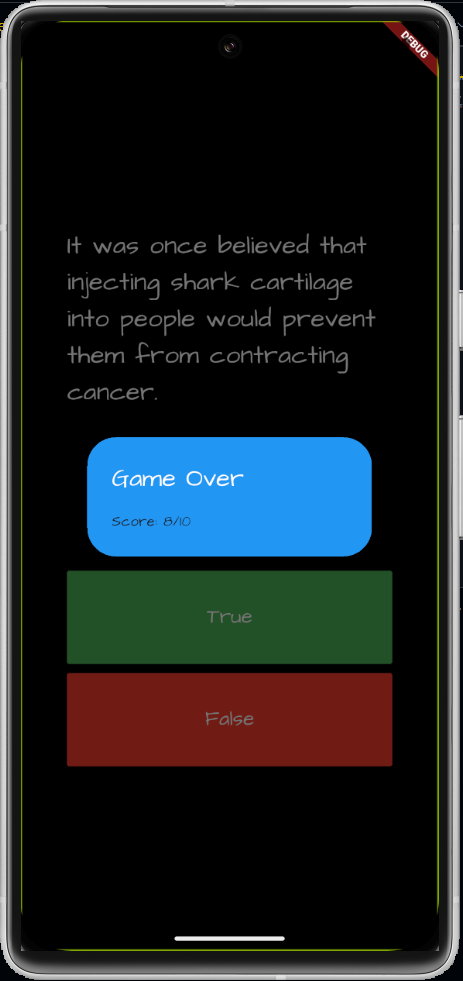

# frivia

Frivia adalah aplikasi berbasis Flutter yang dibuat sebagai proyek pembelajaran dan pengembangan aplikasi mobile interaktif berbasis quiz/trivia.

---

## 🚀 Fitur Aplikasi

- Quiz interaktif dengan UI menarik
- Animasi dan feedback pengguna
- Navigasi antar halaman dengan state management
- Dukungan tema dan tampilan responsif

---

## 🛠️ Teknologi yang Digunakan

- **Flutter** – Framework UI untuk aplikasi multiplatform
- **Dart** – Bahasa pemrograman utama
- **Provider / Bloc / GetX** – Untuk state management (tergantung implementasi)
- **Google Fonts, Lottie, dll.** – Untuk tampilan lebih menarik

---

## 📝 Dokumentasi

Dokumentasi lengkap tersedia dalam folder `documentation-app/`, berisi:

- Gambar saat aplikasi dimulai
- skor akhir
- ui ketika salah menjawab
- ui ketika menjawab dengan benar
- pilihan difficulty dengan slide

## 📷 Tampilan Aplikasi

| Home Page                                        | Final Score                                 | Game Page Correct                                      | Game Page Incorrect                                        |
| ------------------------------------------------ | ------------------------------------------- | ------------------------------------------------------ | ---------------------------------------------------------- |
| .png>) |  | .png>) | .png>) |

---

## 📦 Cara Menjalankan Proyek

1. **Clone** Project ini.
2. **Paste** dengan "git clone `link cloningnya`"
3. **Masuk** ke folder proyek:
   ```bash
   cd frivia-app
   ```

## Install dependency:

- flutter pub get

## Jalankan aplikasi:

- flutter run
